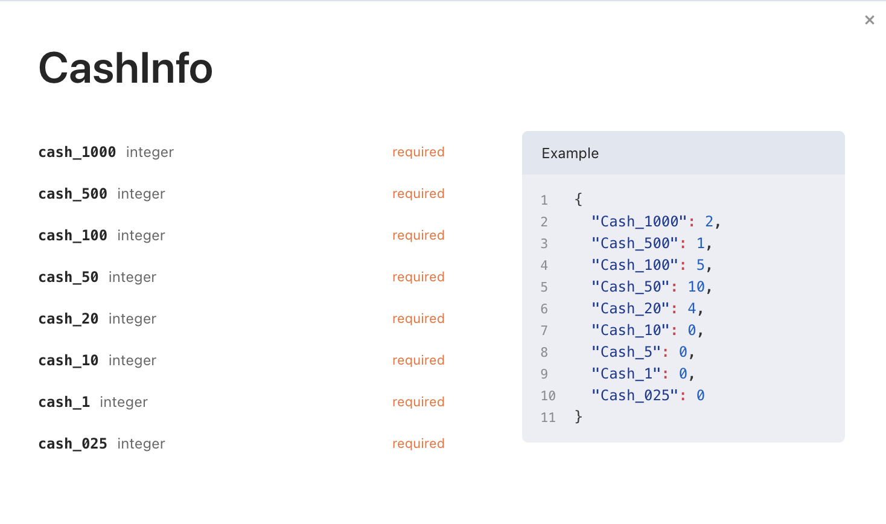
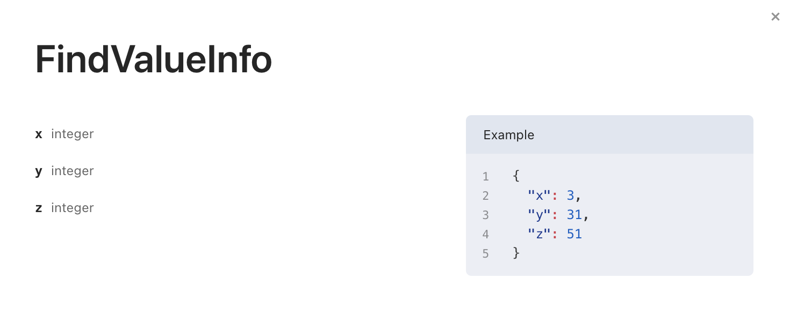

# fidtest_golang

> Outline a brief description of your project.
> Live demo [_here_](https://www.example.com). <!-- If you have the project hosted somewhere, include the link here. -->

## Table of Contents
* [General Info](#general-information)
* [Technologies Used](#technologies-used)
* [Features](#features)
* [Screenshots](#screenshots)
* [Setup](#setup)
* [Model](#model)
* [Dataflow](#dataflow)
* [Room for Improvement](#room-for-improvement)
* [Contact](#contact)

## General Information
there are two questions in this assignment
- Design API to find value x,y,z in data set [1, X, 8, 17, Y, Z, 78, 113]
- Design API to support auto cashier system

## Technologies Used
- MVC Model
- Modulo for calculate money
- air (Hot reload)
- mux for routing

## Features
List the ready features here:
- Cash is accep only number and also end with .25,.50,.75
- Product Price is accep only number and also end with .25,.50,.75
- Cash is much more than product price
    -if cash > all bank note in deck return badrequest
- Cash is equal to product price it will return 200 OK
- Return the change no condition of money limiting

## Screenshots
these pictures will provide body of request and body of response in one picture

- product price accept only number and end with .25,.50,.75

- cash accept only number and end with .25,.50,.75

- product price have to end with .25,.50,.75
- cash also.

- cash is not enough for this product

- cash is equal to product and don't have to get change

- find value of x,y,z

<!-- If you have screenshots you'd like to share, include them here. -->

## Setup
- npm install golang
- git clone https://github.com/26lumineers/fidtest_golang.git
- go install github.com/cosmtrek/air@latest
- air
- Call REST API

## Model
- CashInfo

- FindValueInfo

## Dataflow

## Room for Improvement
Include areas you believe need improvement / could be improved. Also add TODOs for future development.

Room for improvement:
- Improvement of Arithmetic series
- return change money

Goals that have not yet been achieved :
- Registeration
- Discount for membership feature 
- Promotion feature
- Payment Methods feature

## Contact
Created by [@fidz](https://linktr.ee/fidz.firman) - feel free to contact me!

<!-- You don't have to include all sections - just the one's relevant to your project -->
